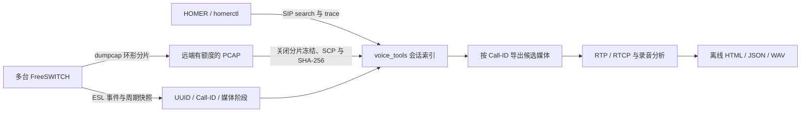

# 采集与排障 2.0

按主叫/被叫在服务器采集、按会话拆分并打包下载，使用新增的 [capture by-number](capture-by-number.md)。

2.0.0 采用 **HOMER 查信令＋远端环形 PCAP 留媒体＋voice_tools 编排与出报告**。HOMER 沿用已有 `homerctl` / `voice-tools homer` 配置；原始媒体由远端 dumpcap 留存；本机完成冻结、校验、会话检索和报告。



## 相对上一版的变化

| 项目 | 上一版 | 2.0 |
|---|---|---|
| 默认采集限额 | 按 snaplen 推导 tcpdump 包数，小包流可能很早退出 | dumpcap 按真实文件字节轮转/限额，默认 snaplen 65535；旧后端显式可选 |
| 历史媒体 | 命令启动后限时抓包 | 多机有截止时间的环形任务，冻结指定历史窗口并取回 |
| 完整性 | 传输摘要、部分退出状态 | 加入损坏/截断片、留存覆盖、采集点丢弃、ESL 缺口及冻结额度状态 |
| 跨分片分析 | 逐文件 SIP/RTP 统计 | 明确同采集点后连续解析，保留重组依赖和原文件摘要 |
| FS 映射 | 周期快照，短呼叫易漏 | ESL 事件＋周期快照；保留断连、刷新超时、采样上限 |
| 媒体变化 | 静态端点 | 观察到的 SDP/FS 阶段、codec、显式 RTCP/rtcp-mux；候选关联 |
| 媒体报告 | 录音和 RTP 头统计 | 加入 G.711 双模式 WAV 重建、RTCP SR/RR/XR 和端点报告指标 |
| 操作 | 多个手动步骤 | `sessions investigate` 编排全流程，保留每步产物与失败状态 |

## 依赖与兼容

- 本机：Python 3.9+、OpenSSH；PCAP 解析需 `tshark`，跨分片需 `mergecap`，均来自 Wireshark 工具集并置于 PATH。非 PCM16 录音另需 FFmpeg/ffprobe。
- 远端 Linux：Python 3.9+、dumpcap、sha256sum、SSH/SCP、标准 shell；快照需要 fs_cli。临时 agent 只使用 Python 标准库，不在主机安装 Python 包或永久服务。
- 已有 SSH 别名、密钥、known_hosts；保持 BatchMode 和严格主机校验。`sudo: true` 以 `sudo -n python3 .../remote.py` 执行整个 agent，需要相应运维权限；不修改 sudoers。agent 将输出所有权交回 SSH 用户。
- 单通 `capture start` 仍是启动前的 UUID 端点快照，不动态改 BPF。需要跟踪多次协商时使用范围采集＋ESL＋离线阶段筛选。
- 默认 CLI 后端改为 dumpcap。`--backend tcpdump` 保留旧 start/batch 行为和 `fetch-batch` 恢复方式，不提供环形/ESL 能力。Python `service.start`、`batch.run_batch` 的旧默认保留兼容。
- 新 JSON 仍为 additive schema 1.0；SQLite 新写入 `user_version=2`，读取兼容旧版本 1。旧消费者可忽略新字段。

## 配置与启动

复制 [ESL 主机示例](../examples/capture/hosts.esl.example.json) 到本地 `data/hosts.json`，替换主机别名、IP、接口、SIP 端口和 RTP/RTCP 范围。最多 16 台机器，各机并发启动，不保证同时刻开始。需要比较跨机时间时自行确认 NTP；工具不调整时钟。

`esl` 可省略，此时仅周期快照。配置后，agent 在远端连接 `127.0.0.1` / `::1` ESL；只接受远端 `password_file` 或 `password_env` 二选一。文件应为主机上已有的受限权限文本文件；环境变量须对 SSH 启动的 agent 可见（sudo 可能清除它）。**清单与 CLI 不接受明文 password 字段。** 完整事件/channel dump 不保存，仅保留白名单字段；认证响应和异常秘密不写入事件文件。

```bash
# 离线计划：不连接主机、不读取远端密码
voice-tools capture ring-start --inventory data/hosts.json \
  --seconds 86400 --segment-seconds 60 --ring-files 32 --max-mib 512 \
  --dry-run --out outputs/ring-plan

# 有限期的环形任务；本地启动命令返回后继续在远端采集
voice-tools capture ring-start --inventory data/hosts.json \
  --seconds 86400 --segment-seconds 60 --ring-files 32 --max-mib 512 \
  --out outputs/ring-job
voice-tools capture ring-status --job outputs/ring-job
```

默认运行 86400 秒，最多 604800 秒，分片间隔 10–3600 秒，环形 2–4096 个文件。每机 `--max-mib` 为 1–16384 MiB，默认 512。以远端自身时钟计算心跳年龄，大于 30 秒未更新的 running 状态标为 unresponsive；不因本地/远端时钟偏差误报。创建远端目录前先将随机任务路径持久化到 job.json；启动中断或 SSH 回执丢失后仍有恢复位置。网络故障保留各机独立结果。

普通包按配置的 IP/CIDR 和 SIP/RTP/RTCP 端口限制。IPv4 后续分片不含端口、IPv6 扩展头链不适合普通端口 BPF，所以还保留限定地址范围内这些 TCP/UDP 包。下游重组后进一步筛选；范围抓包可能包含同地址的相邻流量。

## 配额与完整性

每个环形槽位以总预算除文件数，再预留 snaplen＋记录头边界，交给 dumpcap 原生 `filesize`。**额度限制保留字节，不保证能回看多少分钟。** 高流量下按大小更频繁轮转；默认 32×60 秒只代表无提前大小轮转时的近似时间覆盖。

每机磁盘预算为：环形/窗口 PCAP 不超过 max-mib，冻结副本另有同等 max-mib 额度；事件日志约 16 MiB（两份各约 8 MiB，允许一个记录边界），采集 stderr 日志另限两份各 1 MiB，另有配置、状态和回执开销。冻结预算计入映射日志和清单预留，因此不是所有额度都用于 PCAP；副本不自动释放。`ring-release` 只删除指定冻结副本。停止或截止后原 spool、配置及日志保留，按运维策略清理。

`capture batch` 使用同一 agent 的窗口模式，文件数为 `ceil(seconds/segment_seconds)+1`，最多 4096；超出时要求增加分片间隔或缩短时长。触及文件数或大小轮转预算可早于请求时间结束，此时标 partial，不能承诺抓足时长。

仅在 dumpcap 原生 `-b printname:stdout` 发出关闭通知后，运行中的分片才可冻结，不依赖文件大小稳定或 mtime 排序。按大小轮转已覆盖窗口末尾时立即处理；否则等待时间轮转，避免高流量下固定等待造成证据覆盖。拷贝前后验证大小/修改时间，冻结后保存 SHA-256；SCP 前后与本地再次校验。窗口外邻近包可能被整片带回。早于启动、超过停止时间、已覆盖的历史、文件损坏、截断、事件缺口或上限、已观测采集点丢弃都会保留 partial。

`complete` 表示未发现上述限制，**不证明网络零丢包、FS 映射无遗漏或所有业务会话都被采到**。包的首末时间不是连续覆盖证明；采集点总丢弃、libpcap 报告的丢弃、dumpcap 内部丢弃分别记录，不把总数都标为内核丢包。dumpcap 没提供丢包计数时用 null，不能当作 0。报告中的序号缺口可能来自网络、过滤、采集点或文件缺失。

## 取回、检索与一键报告

先冻结媒体，避免慢 HOMER 查询消耗环形留存时间。所有窗口参数须含时区。

```bash
voice-tools capture ring-fetch --job outputs/ring-job \
  --from '2026-09-19T14:00:00+08:00' --to '2026-09-19T14:05:00+08:00' \
  --out outputs/window
voice-tools sessions index --batch outputs/window --out outputs/index
voice-tools sessions search --index outputs/index --number 1001
voice-tools sessions show --index outputs/index --call-id 'call-a@example.net'

# 已知 Call-ID 后自动冻结、查询、索引、导出、关联和出报告
voice-tools sessions investigate --job outputs/ring-job \
  --from '2026-09-19T14:00:00+08:00' --to '2026-09-19T14:05:00+08:00' \
  --call-id 'call-a@example.net' --profile 1_call \
  --audio data/fs.wav data/terminal.wav --include-audio --decode-rtp \
  --out outputs/investigation
```

一键流程复用已有 HOMER 认证与 `_ref` 身份；HOMER 原生退出码 6 转为可用的部分结果。每一步的 argv、退出码、stdout/stderr 与产物保存在 `investigation.json` 和相应目录。失败步骤不掩盖成功数据；HOMER 不可用时仍继续本地报告。`--skip-homer` 只做本地链路，`--dry-run` 完全离线，单步骤 `--timeout` 为 30–7200 秒（默认 600）。超时可能保留远端已冻结文件，按 job 和主机目录恢复。

如未知 Call-ID，可先 `sessions homer-search --caller ... --from ... --to ...` 发现，再执行上述流程；查询耗时期间历史媒体可能被覆盖，按留存预算安排。

```bash
# 停止自身任务，不按任意 PID 杀进程；仍可取回已关闭分片
voice-tools capture ring-stop --job outputs/ring-job
# 从 window/fs-a/host.json 取得 freeze_id 后，显式释放该副本
voice-tools capture ring-release --job outputs/ring-job --host fs-a \
  --freeze-id 0123456789abcdef0123456789abcdef
```

输出示意：

```text
ring-job/job.json                  # SSH 主机、任务目录与参数；无密码
window/batch.json
window/fs-a/host.json              # 覆盖、健康状态、freeze_id、来源摘要
window/fs-a/part-000001.pcap
window/fs-a/events.jsonl           # FS 快照/事件/缺口
investigation/investigation.json   # 各步状态与恢复线索
investigation/report/report.html
investigation/report/report.json
investigation/report/rtp-audio/*.wav
```

## 同采集点连续统计

批次清单中同一主机的已知分片自动分组；独立裸 PCAP 默认各自分析，必须明确知道属于同一采集点才指定 `--pcap-group`。不会因 SSRC 或号码相同而跨机器合并或去重。已知不同 Call-ID 的导出在报告中分开统计，即使它们复用同一端口和 SSRC。

```bash
voice-tools sessions index --pcap-group fs-a data/a-001.pcap data/a-002.pcap \
  --events data/fs-a/events.jsonl --out outputs/offline-index
voice-tools report build --pcap-group fs-a data/a-001.pcap data/a-002.pcap \
  --pcap-group fs-b data/b-001.pcap data/b-002.pcap \
  --rtp-port 16000 --rtcp-port 16001 --decode-rtp --out outputs/offline-report
```

合并按包时间排序，不去重；保存原文件路径与 SHA-256，索引保留合并产物。导出前再次验证合并文件及原分片，保留被选会话的 IP/TCP 重组依赖帧。共享 TCP 段可能包含相邻 SIP 消息，原始字节不能无损切开，仍须按 Call-ID 读取。

每个组最多 2048 文件、2 GiB。索引默认 100 万包、上限 500 万；报告默认 25 万包、上限 100 万。限额按连续组计算。导出最多 100 万选中帧、100 万条重组依赖；过于零散的帧范围要求缩短窗口，避免生成超长系统命令。缺少 mergecap 时索引可降级逐文件但标 partial；报告对该组保留错误。

## ESL 与媒体变化

订阅 CREATE、ANSWER、BRIDGE、UNBRIDGE、HANGUP_COMPLETE、DESTROY、CALLSTATE、CODEC 和 RECV_RTCP_MESSAGE；连接失败/断线记录 gap，不承诺重放。白名单保留 UUID、Call-ID、peer UUID、号码、媒体四元组、codec 和明确的 `X-CID` / `X-Trace-ID` / `conversation_id`。RTCP 的详细指标以 PCAP 解析为准，不把原始 ESL 事件全量保存。

周期快照默认每 10 秒，允许 5–30 秒或 0 关闭。每轮最多 100 条腿（上限 500），超过则轮转取样并标 gap；事件触发有界 UUID 刷新。没有有效 Call-ID 的事件保留在原日志，索引明确标部分证据。ESL 重连、快照限额和丢失首个创建事件仍可能漏掉短呼叫。

会话展示 `dialogs`、`media_timeline` 和关联依据。SDP 更新跟踪端点、tag、CSeq、codec、ptime、显式 RTCP/rtcp-mux；FS 事件和快照跟踪四元组/codec 变化。双向发起 re-INVITE 时按无序 dialog tags 和发送端跟踪阶段；BYE 按匹配 tag、FS 挂机按 UUID 关闭已观察阶段。一条分叉结束不截断另一条；较晚的挂机事件不延长已过期的快照窗口。**它是观察记录，不是完整 SIP offer/answer、分叉或 NAT 状态机**；拒绝 offer、缺失/乱序信令、重绑定、端口复用仍可能误选。相同业务关联 ID 只作为明确记录的关联线索，不自动证明是同一业务通话。

## 媒体分析边界

- RTP：同方向、四元组、SSRC 连续统计序号回绕、缺口、重复、乱序与跳变；动态 PT 时钟按 SDP 接收端点和观察时间段使用。未知或变化时钟不输出整体 jitter 毫秒值。
- `--decode-rtp`：仅明文、单声道、8 kHz PCMU/PCMA。每流分别输出 payload 拼接 WAV 和 RTP timestamp 补零 WAV，保留重复冲突与未知包数量。支持头扩展/padding；大序号跳变分段。**补零不是 PLC，拼接不是终端真实播放，不模拟 jitter buffer。** 不把两条 mono 流伪造成原始双声道。
- SRTP/未知编码：只要任一端点的有效 SDP 阶段声明 SAVP，相关双向流均拒绝重建；无信令时只能按明文 RTP 假设，无法单靠 payload 确认加密。Opus、G.729 等不支持解码并标明原因。
- 重建预算：每组最多 32 流、保留 payload 64 MiB；单段最长 3600 秒；整个报告 WAV 合计 256 MiB。超过预算保留 partial。RTP 包序号冲突、未知包和不可靠 timestamp 回退不会伪装成完整重建。
- RTCP：compound SR/RR 的发送计数、signed cumulative loss、fraction lost、jitter；同采集点、反向端点的 SR/RR 能匹配时估算 capture-point RTT。**RTT 不是单向时延；SR/RR 是端点报告。** 未知时钟保留 jitter 时间戳单位。
- XR：解析 VoIP metrics 的 loss/discard、round-trip delay 和端点上报 MOS-LQ/MOS-CQ；不自行预测 MOS。其他 XR/反馈包保留类型，不宣称已完整解析。每组最多 10000 RTCP 子包，超限标 partial。

报告为本地 HTML/JSON，所有试听资源留在报告目录。没有自动将录音时间轴与 PCAP 精确对齐、跨采集点去重或根因判定。

## 验证与部署状态

第二轮深度检查、复现及修复记录见 [capture-v2-review.md](capture-v2-review.md)。

2026-09-19：首次交付通过 181 项本地回归；第二轮深度检查增加 20 个反例与边界场景，完整 201 项全部通过（包括 loopback 模拟 HOMER）。真实 CLI 的 ring 离线计划 → index → search → export → report 合成链路再次通过；核对了两份录音、跨分片 1 个序号缺口、2 个 RTCP 子包和 2 份重建 WAV。

接入包含 SIP 拨测功能的 main（`e641836`）后，全仓共 229 项测试：221 项通过，8 项可选 PJSUA2 loopback 测试因环境条件未满足而跳过。运行时 CLI schema、111 条文档链接和 5 个示例报告资源引用检查通过；跳过项不代表已验收。

合成测试覆盖：IPv4 分片和 TCP SIP 跨文件重组及导出回读、分片边界 RTP 缺口、端点/tag 变化、ESL 帧与 EOF/秘密白名单、远端 agent 的本地模拟生命周期、冻结摘要/释放/配额、损坏/截断/丢弃状态、真实 tshark 的动态 PT/RTCP mux、G.711 时间模型、SR/RR/XR 以及 HOMER 失败后的报告链路。

未连接生产 FreeSWITCH/HOMER，也未完成真实负载下的留存时长、权限、时钟和丢包验收。未完成浏览器渲染或实际试听验收；本地浏览器此前拒绝 `file://`，静态资源检查不等于播放成功。

协议依据：[dumpcap 手册](https://www.wireshark.org/docs/man-pages/dumpcap.html)、[Wireshark RTP 分析](https://www.wireshark.org/docs/wsug_html_chunked/ChTelRTPAnalysis.html)、[FreeSWITCH mod_event_socket](https://developer.signalwire.com/freeswitch/FreeSWITCH-Explained/Modules/mod_event_socket_1048924/)、[RFC 3550](https://www.rfc-editor.org/rfc/rfc3550)、[RFC 3611](https://www.rfc-editor.org/rfc/rfc3611)、[HOMER](https://github.com/sipcapture/homer)。
