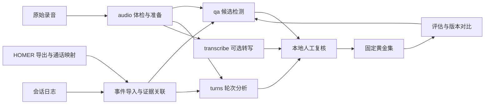

# voice_tools 功能扩展方案

研究日期：2026-09-19。本文是方案，拟议命令和功能尚未实现。

建议定位为 **CPU 优先、以离线分析为核心、可批量使用的语音排障与评估工具集**。先把现有录音质检做成可用于真实业务的工作流，再连接信令证据，扩展通话表现分析和辅助转写。

建议下一版优先交付三项：**录音体检与格式接入、浏览器人工复核、稳定黄金集与版本对比**。通话事件适配可在拿到真实日志后同步推进。默认安装继续保持轻量；模型作为可选能力。

## 1. 研究基线与已验证事实

| 项目 | 本次核验 |
|---|---|
| 远端 | `lovezhl456/voice_tools`，默认分支 `main`，Issue #1 已关闭、PR #2 已合并 |
| 远端提交 | `51712a46ffa1ba0f2b468c0aeb7b9ef52d9f3883` |
| 本地提交 | `ecbcc44cf74f9ea123e751b9941e8fa97f9ec91b`，仍在功能分支；本次未切分支 |
| 内容一致性 | 两者 Git tree 均为 `783c5303012d21098a7ed16b455966de089cb5a7` |
| 当前版本 | `voice-tools 0.1.0`；Python 3.9+；默认 NumPy，可选 WebRTC VAD |
| 本机环境 | Python 3.9.6、macOS arm64、NumPy 2.0.2、webrtcvad-wheels 2.0.14；已有 FFmpeg 8.1.2 |
| 自动验证 | 研究开始时的录音 QA 基线有 37 项测试通过，包含已安装的 WebRTC VAD 测试；约 2.64 秒 |
| CLI 验证 | 新生成并分析 20 个合成场景：0 个处理错误、19 个应答机会、11 个候选；报告及附带音频生成成功 |

本次查阅了 README、架构与使用手册、音频层、检测器、批处理、报告、人工标签与评估模块、测试，以及 GitHub 原始需求。没有用真实通话验证准确率，也没有重新验证浏览器实际播放。合成测试只能说明现有工程规则可运行。

**工作区新增变化：** 收尾时观察到另有未提交的 HOMER 7 CLI 接入：`tools/homer`、`homerctl` 入口、统一 CLI 注册及相关文档和测试。已查阅其入口、分析函数和文档，可见搜索、trace、导出与离线信令风险分析的实现。它不属于上述已提交基线，本次未运行其完整测试或连接真实 HOMER；不能将前述 37 项通过扩展成对它的验收。本文只新增研究文档，没有修改这些接入代码。

### 已有功能，后续应直接复用

- 统一 `voice-tools <tool> <action>` 入口和独立工具注册机制。
- PCM16 WAV 读取，声道角色配置，能量活动检测和可选 WebRTC VAD。
- 应答机会、AI 接管、等待、打断与挂机窗口的事件对齐。
- 区分无输出、迟答、需复核、观察不足、排除和证据不足。
- 目录批处理、逐文件错误隔离、输入和事件 SHA-256、JSONL / CSV / 中文 HTML。
- 附带音频的试听报告、人工 review CSV、黄金标签晋升、precision / recall 评估。
- 20 类合成场景、参数与边界测试。CI 目前仍只有模板。

### 当前能力的实际缺口

| 缺口 | 代码依据 | 实际影响 |
|---|---|---|
| 格式接入较窄 | `audio/io.py:read_wav` 只接受单/双声道 PCM16 WAV | 常见压缩录音、G.711 WAV、分离双文件需先在外部处理 |
| 体检指标没有独立工具 | `audio/activity.py` 已算中位能量、DC、削波比例和重复声道 | 指标主要附在 QA 结果内，缺少逐声道、逐时间段的异常定位 |
| HTML 主要是静态列表 | `recording_qa/reports.py` | 没有波形、左右轨单听、筛选、直接标注与断点复核 |
| WebRTC VAD 仍受能量门限约束 | `activity.py` 使用能量掩码与 VAD 结果相与，VAD 模式固定为 2 | 单纯切换 VAD 不能补回所有低音量语音，也缺少两种方法的分歧解释 |
| 事件需要用户提供 | `metadata_for` 消费统一事件 JSON，但无原始日志适配器 | 生产接入、时间轴换算仍靠手工；不能说明 LLM/TTS/媒体哪个阶段异常 |
| 评估维度有限 | `review.py:evaluate` 合并 missing / delayed 为候选正类 | 没有分场景表现、版本差异、调参流程与置信区间 |
| 大批次恢复不便 | `batch.py` 串行分析，全部记录收集后统一写报告 | 中途退出缺少检查点；全量 HTML 随通话数增长 |
| 长音频仍整体解码 | 512 MiB 指的是 float32 样本数组上限 | 48 kHz 双声道约 23.3 分钟就达到该上限，并非所有格式都能分析满 1 小时；总 RSS 还会更高 |

“候选数少”不是“准确率高”；`OUTPUT_NEEDS_REVIEW`、`CENSORED`、`NO_OPPORTUNITIES` 都不能统计成通话成功。

## 2. 功能优先级

工作量是单名熟悉项目的开发者的粗估，包含相应测试与文档，不含拿数据、业务标注和跨部门等待；不是交付承诺。

| 优先级 | 扩展 | 用户收益 | 主要交付 | 粗估 |
|---|---|---|---|---|
| P0 | 录音体检与格式接入 | 一次看清录音能否分析、哪条轨有问题 | `audio inspect / prepare`、逐声道指标、转换溯源 | 4–6 人日 |
| P0 | 人工复核界面 | 减少在播放器、CSV、日志间切换 | 双轨波形、区间循环、快捷标签、导入/导出复核结果 | 4–6 人日 |
| P0 | 稳定黄金集与版本对比 | 知道改动究竟改善了什么 | 固定标注窗口、分层指标、`qa compare` | 3–5 人日 |
| P1 | HOMER/业务事件关联与阶段耗时 | 将“这一轮有问题”关联到具体链路证据 | 复用在接入的 HOMER CLI、一个业务适配器、事件校验、时间轴 | 4–7 人日，不含 HOMER CLI 本身，另需日志字段 |
| P1 | 通话轮次分析 | 从无声筛查扩展到响应体验分析 | 应答延迟分布、重叠发言、长静默、打断后停止时间 | 3–5 人日 |
| P1 | 参数标定与可选 Silero VAD | 针对轻声、噪声等已知弱点改进 | 线路配置、参数扫描、检测器对比 | 4–6 人日，另需黄金集 |
| P1 | 批处理恢复与增量执行 | 支持日常反复跑录音目录 | 增量 JSONL、恢复、失败重试、报告分页 | 3–5 人日 |
| P2 | 可选 CPU 转写 | 辅助检索和复核“说了什么” | 分轨转写、时间戳、关键词搜索 | 4–7 人日，另需模型实测 |
| P2 | TTS 样本对比 | 帮助比较合成配置与回归问题 | 音频 A/B 试听、前导静音、削波、速度/耗时统计 | 3–5 人日，另需文本和合成事件 |

## 3. P0：下一版的具体范围

### 3.1 录音体检与格式接入

拟议命令：

```bash
voice-tools audio inspect data/calls --out outputs/inspect-001
voice-tools audio prepare data/raw --sample-rate 16000 --out data/prepared-001
```

`inspect` 输出格式、编码、时长、声道、采样率及逐声道峰值、有效活动电平、静默比例、削波/DC 异常区间。复用已有指标，但把“全通话中位能量”和“说话期间能量”区分开，避免长静默拉低指标造成误读。增加双轨高度相似的提示；互相关只是串音线索，不能自动确认串音或推断用户身份。

`prepare` 使用显式 FFmpeg 预处理，先支持 WAV、FLAC、MP3、M4A，以及有明确格式信息的 G.711 输入。裸 PCM 必须提供编码、采样率、声道数。转出的分析副本与原始文件分开保存；记录输入/输出摘要、工具版本、声道映射、采样率变化和时间变换。

双文件合轨作为后续小版本：要求角色映射及可靠的共同起点/偏移。没有同步证据时只保留两份独立音轨。单轨输入可体检，仍不能获得双轨角色证据。

验收重点：

- 每种实际采用的格式都有解码夹具；覆盖损坏文件、空文件、未知通道布局和不支持格式。
- 声道不交换、单双声道数量不被静默改写；单轨不复制成双轨。
- 未发生裁剪时，受控 PCM 重采样标记的对齐误差目标不超过现有一帧 20 ms；压缩格式的编码延迟需单独核对。超出容差或无法确定映射时显式阻断高证据事件对齐。
- 削波和音量分析保留原始证据。降噪、增益归一化若以后增加，应成为另存的试听副本，不能悄悄用于无声判定。

### 3.2 浏览器人工复核

在现有 HTML 报告上增加交互即可，首版使用本地静态页面和文件导入/导出，避免先引入常驻服务和数据库。

核心操作：按候选类型、证据等级和文件筛选；显示用户轨/AI 轨波形与应答窗口；单独试听任一轨或双轨；前后扩展区间、循环播放、快捷键标注；逐条保存为复核文件并可重新导入。页面离开前明确显示未导出进度，不能仅依赖浏览器临时存储。

复用现有五类人工标签和 `qa promote` 校验。波形、预览片段、原音频应可区分；导出片段记录相对原录音的起点，不修改原 `sample_id`。文件链接使用可携带的相对路径。分享模式可隐藏本机绝对路径，音频仍需显式选择打包。

验收重点：

- 完成“筛选→单轨试听→标注→导出→重新导入→晋升黄金集”的完整流程。
- 标签绑定正确的音频摘要、事件摘要、机会与窗口；错配文件、重复导入和半填记录有可读错误。
- 375 px 手机视口与桌面可用，关键按钮可键盘操作；浏览器无未处理错误。
- 真实浏览器验证 `currentTime` 推进、区间循环和声道切换，并人工确认左右轨声音。HTTP 200 或播放器存在不能代替实际试听。

### 3.3 稳定黄金集、版本对比和评估口径

拟议命令：

```bash
voice-tools qa compare --baseline outputs/run-a/results.jsonl \
  --candidate outputs/run-b/results.jsonl --golden data/golden/v1.json \
  --out outputs/compare-001
```

先修正数据组织，再增加更多算法。当前 `sample_id` 由录音和事件摘要生成；自动机会 ID 随检测参数变化，而且评估要求观察窗口完全一致。因此参数实验要固定 **应答机会、用户讲话区间、排除区间和 AI 接管/退出时间**，单独固定机会 ID 不够。

本次用受控合成样例验证了这一点：同一录音、同一 `turn-1`、同一 6 秒起点，事件未提供 `user_speech`。当能量阈值从 −45 dBFS 改为 −65 dBFS 时，新识别出 10 秒处的轻声用户活动，窗口由 18 秒缩为 10 秒，判定从 `NO_OUTPUT_CANDIDATE` 变为 `CENSORED`。这说明窗口必须独立冻结，不能把这种变化直接当作检出改进。

建议黄金集补充：

- 人工确认的首次可听回答时间、应答期望、固定窗口，以及采用的迟答标准/策略版本。
- 线路、采样率、编码、场景标签、复核记录和分歧处理；场景标签可包括轻声、噪声、音乐、等待、打断、串音。
- 按通话或来源组划分校准集和留出验证集，同一通话的不同片段不跨集合。
- 在原有二分类指标之外，分别报告无输出和迟答的表现、每百个可计分机会的误报、各场景漏报，以及标签/证据覆盖率。
- 候选集之外随机抽样复核普通结果，否则无法估计漏检；`exclude`、`uncertain`、观察不足和错误要独立计数。

若需要扫描应答阈值，人工标签应记录原始回答时间及业务策略，不能让算法自己生成“正确迟答”标签。比较器拒绝事件或窗口不一致；跨数据版本比较先做显式映射，不靠相同文件名猜配。

验收重点：相同输入和参数重跑业务结果一致；比较页可逐条查看新出现/消失/变类的候选；精确度与召回率展示样本量、分母和区间估计。小样本零漏报不宣称生产零漏报。第一批可从 50–100 通分层抽样开始试标，具体规模根据异常频率和人工成本调整，该数量不是准确率证明。

## 4. P1：从录音现象走向通话分析

### 4.1 事件导入与阶段耗时

工作区已有 HOMER CLI 接入在进行，后续应复用其查询、trace、export 与离线 `analyze`，优先增加录音与信令的关联层。拟议 `voice-tools correlate build` 消费录音分析结果、已导出的 HOMER JSON 和通话映射表，不要求离线 QA 必须连接服务。在线抓取保留为显式独立步骤。

第一版以 `call_id`、录音 ID、业务会话 ID 和时间范围关联，允许一通业务会话对应多个 SIP Call-ID；转接或 B2BUA 改写后的呼叫腿需要明确映射。仅凭主被叫号码和时间接近匹配的记录标为待确认。复核页可并排查看录音候选、SIP 时间线和源报文引用。

HOMER 信令不能提供用户说完、LLM 首 token 等全部业务事件。再针对一个真实来源实现适配器，例如 FreeSWITCH 会话事件或业务 JSONL。具体来源要以实际系统为准。归一化字段建议包含 `call_id`、`turn_id`、`event_type`、`source_clock`、`timestamp`、录音起点映射和原始记录引用。

区分用户停止发言、ASR 完成、LLM 请求/首 token/结束、TTS 请求/首音频/结束、媒体发送和可观测播放事件。仅有时间接近不代表同一轮；优先使用明确的通话与轮次 ID。处理重复、乱序、跨文件、缺失事件以及时间偏移。

输出各阶段可观察耗时与证据覆盖率。例如“日志记录 TTS 完成，但录音 AI 轨未检出活动”，下一步应核对下行媒体、播放或录音链路；这条证据本身不能确定根因。SIP 通话建立不证明音频正常，HOMER 导出的 PCAP 也不保证含完整 RTP；RTP 已发送不等于用户已听见。

验收：受控通话校准时钟后能对齐到明确容差；映射失败降级为未对齐事件，不能自动提高到 `event_aligned`。每个耗时区间能回到两端事件和源记录，缺端点显示未知。

### 4.2 通话轮次和体验指标

拟议 `voice-tools turns analyze`。优先复用现有活动区间，新增：

- 用户停顿到系统轨首次活动的 P50/P90/P95，同时展示已观察回答数与删失/排除数；无回答的窗口不以零延迟填充。
- 双方活动时长与重叠区间、超长静默、首次问候延迟。
- 用户插话到 AI 轨停止活动的时间；有明确取消事件时单独展示业务确认的打断响应。
- 按日期、线路、业务版本聚合，但保持同一参数和证据口径。

`acoustic_only` 指标叫“活动间隔”；业务事件明确后才称“应答延迟”。现有检测器会把已经持续的系统活动与机会起点的重叠记作零延迟，因此应新增“起点前已有活动”标志，防止把残留提示音当作瞬时新回答。重叠发言也不能自动称为抢话或打断失败。

### 4.3 参数标定与检测器对比

先支持按线路保存参数配置和 provenance，再考虑 Silero。扫描用户/AI 独立能量门限、最短活动、停顿合并、WebRTC 模式。低音量和用户短应答对两条轨的影响不同，不宜永远共用一套门限。

每次扫描绑定固定黄金集和窗口，只在校准集挑参数，在留出集报告效果。报告同时显示 CPU 耗时、峰值 RSS、实时因子（处理时长/录音时长）、误报/漏报和复核负担。能量与 VAD 分歧可作为优先复核线索，不能伪装成校准过的概率。

Silero VAD 作为可选 ONNX 后端，模型提前下载并校验摘要，分析时从本地加载。其官方 Python 包仍依赖 torch/torchaudio；若要尽量保持安装轻量，需要单独实现 NumPy + ONNX Runtime 适配，核对输入窗口、状态和采样率，并验证其与参考实现的一致性。不能直接把“ONNX”当作“无重依赖”的保证。

### 4.4 批处理恢复与增量执行

先逐文件落盘、原子写入完成标记、支持恢复和失败重试，再考虑并行。缓存标识至少包含音频/事件摘要、工具版本、算法与模型版本、有效配置和 schema。

默认仍串行；`--workers` 必须受内存预算约束。处理长音频时做分块读取，并为 VAD 状态、活动合并、跨块窗口保留连续性。不能只把当前整文件解码逻辑套进线程池。

验收：中断后恢复结果与完整重跑一致；输入或配置改变会使相关缓存失效；损坏一条录音不丢失其他结果。用代表性真实时长和采样率测吞吐与 RSS，规模目标由实际每日录音量决定。

## 5. P2：可选转写与 TTS 对比

### 5.1 CPU 辅助转写

候选为 `faster-whisper` 的 CPU INT8 路径，先比较多语种 tiny/base/small 在真实中文电话音频上的字错误率、关键词召回、时间戳偏差、实时因子和内存。模型大小、参数量不能直接换算成这台机器上的吞吐。

拟议 `voice-tools transcribe run`，两条真实独立声道分别转写，沿用已验证的角色映射；单轨仅生成不确定角色的文本。导出 JSON、字幕和可搜索文本，供复核页跳转。长静默上生成的文本应带复核提示，不能把 ASR 文本当作确有声音的证据。

默认安装不包含 ASR；显式模型准备步骤负责下载，日常分析只允许本地模型。`--help` 和普通 QA 不触发模型加载或网络请求。转写文本可能包含敏感内容，沿用现有本地输出与音频隔离方式。

### 5.2 TTS 样本与版本对比

先消费已有文本、合成 WAV 和本地事件记录：比较前导/尾部静音、截断、削波、整体时长、固定文本的发音差异，提供盲听 A/B 和人工偏好记录。

已有请求时间与首音频事件时才统计首包延迟或合成耗时；离线 WAV 单独无法推导服务延迟。缺乏参考/标定时不输出貌似客观的 MOS 总分。外部 TTS API、计费调用与实时调用器另行定义范围。

## 6. 技术选型核验

| 能力 | 建议 | 已核验事实 | 尚未证明 |
|---|---|---|---|
| 元数据/格式转换 | FFprobe + FFmpeg，作为可选外部程序 | 本机可用；已读取合成 WAV 的 JSON 元数据。官方文档描述重采样可能涉及时间戳处理 | 各生产录音格式、编码延迟与日志时间映射 |
| 基础活动检测 | 保留 NumPy + WebRTC | 现有环境与测试可运行，默认路径无模型 | 真实噪声/轻声的检出效果 |
| 可选 VAD | Silero ONNX | 官方声明支持 8/16 kHz；MIT；ONNX-only 可自行实现 I/O 与适配 | 本项目样本上的收益、macOS wheel/线程/峰值内存表现 |
| 可选 ASR | faster-whisper CPU INT8 | 官方支持 CPU INT8、词级时间戳和本地模型目录；Python 3.9+；MIT | 本机中文电话录音准确率与吞吐、所选依赖组合安装可用性 |
| 复核界面 | 先做静态 HTML + 浏览器音频 API | 可直接承接现有报告生成链 | 需要重新完成真实浏览器播放和标注验收 |

Silero 核验提交：`60b7ffa243625ebdc1070275a29f18c87843786a`。

faster-whisper 核验提交：`ed9a06cd89a93e47838f564998a6c09b655d7f43`。

本次没有安装这些新模型库、下载模型或做性能对比。官方公布的速度不作为本项目验收值。若之后对外分发，先明确本仓库许可证，并按选定 FFmpeg 构建、第三方代码和具体模型分别核对分发要求；当前仓库未声明许可证。

## 7. 保持当前架构，按真实复用逐步扩展



保留正在接入的 `tools/homer`，按实现进度增加 `tools/audio`、`tools/events`、`tools/correlate`、`tools/turns`、`tools/transcribe`，`qa compare` 等仍属于 `tools/recording_qa`。共享的音频转换/指标留在顶层 `audio/`；第二个工具确实需要时再抽取时间轴、事件校验和批处理基础能力。跨工具通过明确数据契约或公共模块连接，不直接导入另一个工具的业务实现。

稳定边界：原音频摘要与派生音频摘要分开；分析运行 ID 与样本 ID 分开；结果记录配置/模型摘要；时间字段明确来源与原点；业务 schema 变更提供迁移或拒绝旧格式的清晰错误。现有 `qa` 命令与退出码保持兼容。

## 8. 推荐实施顺序与完成标准

1. **第一轮：真实数据可复核。** 实现 `audio inspect/prepare`、交互复核、稳定标注窗口与 `qa compare`。串行工作量约 11–17 人日；受控录音确认声道、时间映射和浏览器试听后，再扩大采样。
2. **第二轮：评估与解释可比较。** 使用版本对比分析真实样本，连接 HOMER 导出与录音，再接一个真实业务日志来源，补轮次统计和线路参数标定；按检出误差决定是否加入 Silero。
3. **第三轮：按实际负载拓宽。** 数据规模确实需要时做分块和恢复；复核确实需要文本时加入 CPU ASR；TTS 对比作为独立工具。

上线/日常使用前的完成标准应包含：

- 现有 37 项回归保持通过，新增功能有对应工程夹具和失败路径验证；有条件时启用已有 CI 模板，是否具有 workflow 写入权限需到时核验。
- 真实黄金集有来源、分层、独立复核和留出样本；至少同时报告误报与漏报，不能只看候选检出率。
- 代表性批次的处理时长、峰值内存和人工复核耗时有本机记录；性能目标在实测基线后确定。
- 能从每条结论追溯到原音频、对应窗口、参数和事件；观察不足/未对齐/未验证角色都有明确状态。

暂缓通用插件市场、多租户后台、单轨自动角色识别、端到端大模型判责、无参考 MOS 和实时 RTP 抓包。它们需要不同的数据、运行条件或验证方式，应在现有离线流程稳定后按真实需求立项。

## 9. 后续实现需要补齐的业务输入

方案本身不依赖这些信息；实施日志适配、校准和性能目标时需要：每日录音量与典型时长；编码和声道来源；少量可用于开发的脱敏真实录音及对应日志；各阶段的应答 SLA；人工复核资源；优先容忍漏报还是误报。日志缺失时，第一轮体检与复核仍可独立落地。

## 10. 一手来源与本地证据

- [原始需求 Issue #1](https://github.com/lovezhl456/voice_tools/issues/1)，明确 CPU、轻量、批量和人工黄金集要求。
- [已合并 PR #2](https://github.com/lovezhl456/voice_tools/pull/2)。
- [审查的主分支快照](https://github.com/lovezhl456/voice_tools/tree/51712a46ffa1ba0f2b468c0aeb7b9ef52d9f3883)。
- 本仓库：[架构约定](architecture.md)、[录音质检手册](recording-qa.md)、[活动检测](../src/voice_tools/audio/activity.py)、[候选检测](../src/voice_tools/tools/recording_qa/detector.py)、[批处理](../src/voice_tools/tools/recording_qa/batch.py)、[人工评估](../src/voice_tools/tools/recording_qa/review.py)。
- [FFprobe 官方文档](https://ffmpeg.org/ffprobe.html)、[FFmpeg 重采样文档](https://ffmpeg.org/ffmpeg-filters.html#aresample)。
- [Silero 官方 README 固定提交](https://github.com/snakers4/silero-vad/blob/60b7ffa243625ebdc1070275a29f18c87843786a/README.md)、[依赖声明](https://github.com/snakers4/silero-vad/blob/60b7ffa243625ebdc1070275a29f18c87843786a/pyproject.toml)。
- [faster-whisper 官方 README 固定提交](https://github.com/SYSTRAN/faster-whisper/blob/ed9a06cd89a93e47838f564998a6c09b655d7f43/README.md)、[Python 版本声明](https://github.com/SYSTRAN/faster-whisper/blob/ed9a06cd89a93e47838f564998a6c09b655d7f43/setup.py)。

本地原始核验材料位于 `outputs/research-2026-09-19/`：测试日志、CLI 合成运行统计、固定机会窗口变化样例、官方 README/依赖/许可证快照及摘要清单。该目录沿用仓库忽略规则，不包含真实通话，不随代码提交。
