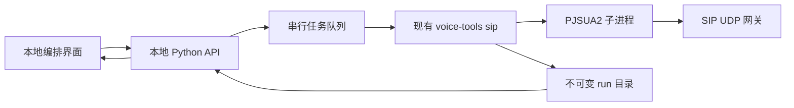

# 拨测工作台产品与技术设计

日期：2026-09-19。结论：采用「用例库 + 顺序步骤画布 + 参数侧栏 + 独立素材/环境库」，在现有 PJSUA2/Python CLI 上添加可视化编排层。第一版不需要完整连线引擎或 FreeSWITCH/ESL 执行服务。

## 1. 社区调研与取舍

这是官方文档/仓库审阅，未安装这些平台，也未把商业产品界面源代码视为开源。精确 URL、版本 commit、快照 hash 见 [sources.json](sources.json)。下表中的“借鉴”是本项目的设计判断。

| 产品 | 已核实事实 | 本项目借鉴 | 不直接采用的原因 |
| --- | --- | --- | --- |
| [XSwitch](https://xswitch.cn/) | 官方定位为通信平台，提供 Web UI/低代码/API。用户手册的外呼管理包含任务开始/停止、放音/路由、状态与挂机原因；扩展功能包含媒体文件和录音管理、SIP 流程诊断 | 用例/素材/目标环境/运行结果分开；结果页保留通话 ID 与原因；呼叫任务有可见状态 | 用户不需要完整交换/外呼管理平台。公开 `xswitch-free` 是基于 FreeSWITCH 的裁剪 Docker 镜像，不能据此认定完整可视化编辑器开源 |
| [Node-RED](https://nodered.org/docs/user-guide/editor/) | 官方编辑器具有 palette、workspace、sidebar；可拖入节点；subflow 可封装复用流程。仓库 Apache-2.0 | 步骤库、工作区、属性侧栏、复用模板；插件声明式配置 | 通用消息流的连线/部署概念比当前顺序拨测复杂。不是现成 SIP 用例编辑器 |
| [Jambonz Node-RED 节点](https://github.com/jambonz/node-red-contrib-jambonz) | README 列出 play/dtmf/gather/hangup/record 等电话节点；用于构造 Jambonz webhook 响应。feature-server README 列出 Drachtio、FreeSWITCH、MySQL、Redis 依赖 | 将电话动作做成小型语义节点，参数随节点变化 | 其业务运行栈与轻量现有 CLI 不同；不能因同名节点就复制 record/gather 的运行语义。节点包许可证需单独核查，未视为 MIT |
| [Twilio Studio](https://www.twilio.com/docs/studio/user-guide) | 官方提供 Widget Inspector、Transitions、草稿测试、Flow 导入导出/复制；商业云产品 | 参数侧栏、草稿与执行状态区分、模板导入导出、测试前检查 | 商业 UX 参照；不是开源免费自托管方案。无需引入账户、云运行和计费 |
| [Restcomm Visual Designer](https://github.com/RestComm/visual-designer) | 仓库描述为 Visual Designer，AGPL-3.0；此次元数据最后推送为 2018-06-19。未验证最新可运行性 | 作为电话可视化领域的历史参考 | 年代较久，额外授权与维护评估；不作为本项目基础，不推断具体当前 UI 功能 |
| [React Flow / xyflow](https://reactflow.dev/learn) | 自定义节点、连接和画布交互的前端库；核心仓库 MIT | 未来真正需要分支/连线时的候选 | 它不是 SIP 服务；当前有序列表用原生拖放即可，避免画布缩放/连线负担 |

XSwitch 的“菜单管理”文档说明的是后台菜单显示配置，不能当作 IVR 流程编辑证据；SIP“流程图”指诊断报文链路，也不能当作业务编排器。本轮未找到足以核实其完整拖拽编辑器交互与源码许可证的公开证据，保留该未知项。

相关 XSwitch 原始文档：[外呼管理](https://docs.xswitch.cn/xswitch-user/auto-call/)、[扩展功能](https://docs.xswitch.cn/xswitch-user/advanced/extended/)、[菜单管理](https://docs.xswitch.cn/xswitch-user/advanced/menu/)。只在报告中摘述产品事实，不分发官方图片或整站副本。

## 2. 核心用户与任务

目标是少量自动化 IVR/语音机器人回归测试。操作者希望把“接通后等 2 秒 → 播一句话或按 1# → 等待应答 → 挂断”变成可复用用例，并在换环境后重复执行与查证。

主要信息结构：

1. **用例**：名称、标签、步骤顺序、所选环境、草稿导入导出。
2. **素材**：WAV 与 PCAP 转换媒体清单、路径/格式/时长、真实试听；不把文件选择等同上传安装。
3. **环境**：目标/账号/代理/注册、编解码器、端口/IPv4、超时、密码变量名。
4. **记录**：执行状态、媒体判定、业务判定分别显示；事件时间轴、实际 RX 与来源重建分开。

## 3. 编排交互

桌面采用左侧步骤库、中间顺序卡片、右侧属性栏。上方是用例名称/环境与导出/预演。卡片显示序号、步骤名称、关键参数与预计时长，选中状态明确。沿中间时间顺序进行拖放，不显示任意连接点。

- 默认呼叫起点只是状态说明；不编译成不存在的 `dial` action。拨号来自 scenario 顶层 target/account。
- 当前动作只有 wait、play、dtmf、play_media、hangup；挂断只允许末尾一项。
- 默认无缺失媒体用例：wait 2 → dtmf 1# → wait 3 → hangup。
- 复制步骤生成新 ID；删除后允许撤销。移动端通过点击添加、↑ ↓ 排序，并滚动到参数栏。
- 键盘可聚焦卡片，Enter/Space 进入参数，Alt+↑/↓ 排序。撤销/重做支持按钮和 Cmd/Ctrl+Z、Shift+Z。
- 已知动作预算超出 max_call_s 阻止下载；未知媒体时长明确显示待确认，后续 CLI 才能完成整体校验。
- 导入错误不能覆盖已有用例。未知 action/字段和明文 password 字段要拒绝；不静默丢弃或转换。

「离线预演」是确定性的时间安排视图，不实时播放、打电话或验证业务。业务断言作为下一阶段结果能力；没有实现 ASR/VAD 时不出现“匹配通过”。

## 4. 数据模型与插件契约

`case.studio.json` 和 CLI `scenario.json` 独立版本化：

```json
{
  "studio_version": "1.0",
  "title": "IVR 按键导航",
  "tags": "IVR, 回归",
  "environment": {"name": "本地回环", "config": {"target_uri": "sip:peer@127.0.0.1:5070", "account": {"id_uri": "sip:tester@127.0.0.1"}}},
  "steps": [{"id": "local-node-id", "label": "选择菜单", "action": "dtmf", "digits": "1#", "method": "rfc4733", "duration_ms": 160, "gap_ms": 100}]
}
```

环境导出为快照而非机器上不可解析的 envId。编辑器插件当前内置注册，包含 action/name/icon/defaults；编译器使用显式字段白名单，禁止把 UI 状态混入 CLI。生产版可扩展为：

```text
plugin.id + plugin.version
  parameterSchema → typed inspector
  validate(config, context) → errors + pendingChecks
  estimate(config, assets) → knownSeconds | unknown
  compile(config, capabilities) → supported CLI steps
  capabilities → required CLI feature/version
```

插件安装不是任意 JavaScript 或 shell 命令执行。初期只接受项目代码中审阅过的定义。新插件必须同时增加 CLI 能力发现、编译和拒绝旧版本用例的测试；不能仅在画布上添加一个漂亮卡片。

## 5. 建议落地架构

当前交付：纯 HTML/CSS/JavaScript，无依赖和构建链。便于验证交互、离线分享，`core.js` 是可在 Node 和浏览器复用的纯编译器。生产化建议保留三层：



不引入 FreeSWITCH/ESL 执行服务，也不让浏览器直接发送 SIP UDP。默认串行单呼叫；UI 使用选定、可复用的 JSON 契约。前端复杂度增长后可迁移 React + TypeScript；顺序拖拽选轻量 sortable 组件，真正加入可执行分支后再评估 React Flow。

建议后端协议（设计，尚未实现）：

| 接口 | 行为 |
| --- | --- |
| GET /api/capabilities | CLI schema/版本、PJSUA2/tshark/SIPp 可用性，区别本机能力与目标连通性 |
| POST /api/validate | 生成工作区内的临时 scenario，以 argv 数组调用 CLI validate，返回完整素材验证/预算 |
| POST /api/assets/inspect | 受控路径解析、WAV 检查或离线 pcap-inspect；显式选择流后再导入 |
| POST /api/runs | 固化用例和素材引用、创建唯一新目录、排入单呼叫队列；返回 run_id |
| GET /api/runs/{id}/events | SSE 增量投递实际 events；包含序号，重连不重复应用 |
| POST /api/runs/{id}/cancel | 向任务进程发送 SIGTERM，等待正常收尾，最终显示 interrupted |
| GET /api/runs/{id}/artifacts | 仅列举/读取该任务目录的受控文件，不接受任意绝对路径 |

默认只监听 127.0.0.1，同源 UI；写入/运行 API 校验 Origin 和本机会话令牌，拒绝跨站发起呼叫。认证秘密只留在执行环境，日志保留变量名。CLI 使用 argv 而非 shell 拼接。运行中锁定参数快照；重新运行创建新的 run_id，禁止覆盖已有录音。取消/崩溃恢复必须保留失败证据。以上是连接执行服务时需要落实的边界，不宣称原型已具备。

## 6. 三阶段交付

| 阶段 | 范围 | 完成标准 |
| --- | --- | --- |
| P0：本次 | 用例/素材/环境管理、顺序拖拽、参数检查、JSON 导入导出、离线预演 | 浏览器操作通过，导出经实际 CLI 离线验证；没有真实呼叫 |
| P1：本地执行 | 小型 Python API、串行队列、CLI doctor/validate/run/cancel、SSE 与产物展示 | pjsua 本地真实回环；Baresip 独立互通单独验收，失败不得隐藏；关闭/取消能收尾 |
| P2：回归增强 | 模板库、用例版本、参数化数据、批次比较、音频/业务断言 | 每种断言具备独立证据；批次有目标数量与运行边界；分支须先扩展 CLI 契约 |

本轮没有重新运行 PJSUA2/Baresip/公网呼叫。以前的互通记录属于原 CLI 验收，不能用来宣称可视化原型的真实执行通过。已知深度复查中的 Baresip 波形失败需要独立解决，不靠 UI 将其渲染成成功。

## 7. 验收重点

关注用户能否实际造出可运行用例，而非只有页面截图。检查：插件拖入及卡片拖动、移动端替代排序、侧栏连续编辑、用例复制搜索、导出→重新导入保持执行语义、无效数据拒绝且旧用例保留、WAV 实际格式/样本、清单事件边界、密码字段拒绝、刷新恢复和存储失败说明。

当前验收结果独立维护在 [acceptance.md](acceptance.md)。
