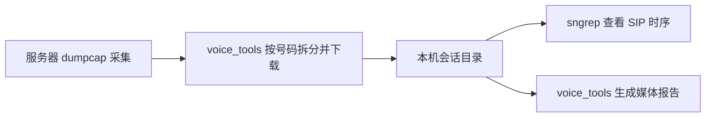

# voice_tools 与 sngrep 联动：快速说明

**voice_tools 负责抓包、按号码筛选和取回文件；sngrep 负责人工查看 SIP 呼叫时序；媒体统计和音频分析继续交给 voice_tools 报告。** 两者通过 PCAP 文件交接，目前需要手动执行以下命令，没有新增 `--backend sngrep` 或自动打开按钮。



本机先按 [安装与使用手册](sngrep.md) 安装 sngrep。以下命令在已安装 voice_tools 的环境、仓库根目录执行。推荐流程只在本机安装 sngrep，服务器继续使用现有抓包依赖。每次使用新的输出目录；下面的主机、号码和路径需按实际情况替换。

## 1. 按号码抓取并下载

先配置[主机清单](../examples/capture/hosts.esl.example.json)，把 SSH、接口、服务器地址、SIP 端口和 RTP 范围改为实际值。清单中的 `fs-a` 是后续示例使用的主机名称。采集应覆盖呼叫建立阶段，尽量包含 SIP/SDP。

```bash
# 离线核对配置与采集计划
voice-tools capture by-number --inventory examples/capture/hosts.esl.example.json \
  --caller 1001 --seconds 300 --dry-run --out outputs/sngrep-plan-001

# 开始采集；随后发起测试通话，等待服务器处理并下载 ZIP
voice-tools capture by-number --inventory examples/capture/hosts.esl.example.json \
  --caller 1001 --seconds 300 --out outputs/sngrep-capture-001
```

筛选被叫时改用 `--callee 1002`；同时填写主叫和被叫表示二者都满足。号码采用精确字符串匹配。服务器会先采集配置范围内的流量，再拆分目标会话；下载到本机的是匹配会话包。详细参数、限额、partial 状态及恢复方法见[按号码抓包](capture-by-number.md)。

## 2. 解包并打开一通电话

```bash
mkdir -p outputs/sngrep-unpacked-001
unzip outputs/sngrep-capture-001/fs-a/sessions.zip -d outputs/sngrep-unpacked-001
```

打开解包后的 `manifest.json`，根据实际 Call-ID 找到该条目的 `directory`。下面的 `SESSION_DIRECTORY` 替换成这个完整相对路径，例如 `sessions/某个哈希值`，不能只填写号码。

会话通常导出为 PCAPNG。这里用 Wireshark 的 `editcap` 转成经典 PCAP，便于不同 sngrep/libpcap 版本读取；保留原始会话目录和清单用于报告及溯源。

```bash
editcap -F pcap \
  outputs/sngrep-unpacked-001/SESSION_DIRECTORY/0001.pcapng \
  outputs/sngrep-view-001.pcap

sngrep -F -r -I outputs/sngrep-view-001.pcap
```

在通话列表用方向键选择记录，按 Enter 查看时序；重点看 INVITE、183/200、ACK、BYE、错误响应及 SDP 地址/端口。`-F` 忽略本机默认配置，`-I` 表示离线读取，通常不需要 sudo。若会话目录有多个抓包文件，应按清单逐个确认；同一采集点的连续分片可按[使用手册](sngrep.md#读取与合并已有抓包)合并后查看。

## 3. 对同一份原始会话生成媒体报告

```bash
voice-tools report build \
  --session-export outputs/sngrep-unpacked-001/SESSION_DIRECTORY \
  --decode-rtp --out outputs/sngrep-report-001
```

打开生成的 `report.html`，查看 RTP 序号缺口、抖动、RTCP 和支持的 G.711 音频重建。**报告使用原始会话目录，不以 sngrep 重新保存的筛选文件替代原始证据。** 报告与试听边界见[抓包与报告指南](capture-report.md)。

## 已经有抓包时

- 已有包含 SIP/SDP 的经典 PCAP：直接运行 `sngrep -F -r -I session.pcap`，省略重新抓取。
- 已有按号码下载的 ZIP：从第 2 步开始。
- 已有[环形采集冻结窗口](capture-v2.md)：保持原有索引/导出流程，打开导出的会话 PCAP；同一采集点分片可合并，不把不同服务器的包直接混成一次观测。
- 只有 `capture start --uuid` 得到的媒体 PCAP：它可能不含 SIP，sngrep 通话列表为空并不代表没抓到 RTP。继续用 `voice-tools report build --capture 抓包目录 --out 报告目录`；需要看 SIP 时序时，再使用包含信令的按号码/批量窗口或 HOMER 查询。

安装、交互按键、现场实时查看及常见问题：[sngrep 安装与使用](sngrep.md)。
